# 无人值守Linux安装iso
## 实验要求
- [x] 如何配置无人值守安装iso并在Virtualbox中完成自动化安装。  
实现特性：  
&ensp;- [x] 定制用户名和默认密码  
&ensp;- [x] 定制安装OpenSSH Server  
&ensp;- [x] 安装过程禁止自动联网更新软件包
- [x] Virtualbox安装完Ubuntu之后新添加的网卡如何实现系统开机自动启用和自动获取IP？
- [x] 如何使用sftp在虚拟机和宿主机之间传输文件
## 实验环境
物理机：win10  
虚拟机：Virtualbox中[Ubuntu 18.04.4 Server 64bit](https://mirror.tuna.tsinghua.edu.cn/ubuntu-cdimage/releases/18.04/release/) 
网络环境：NAT+host-only(192.168.56.107)
## 实验步骤
1. 先以有人值守方式安装ubuntu，步骤如下。    
下载ubuntu-18.04.4镜像并安装，安装过程中已设置用户名和默认密码，如下图选择安装了OpenSSH Server，安装后备份纯净系统。
* 安装ubuntu，有一个自动更新，如果选择，每次一打开系统就自动更新了，由于做作业不选择，生产环境下选择是错误行为
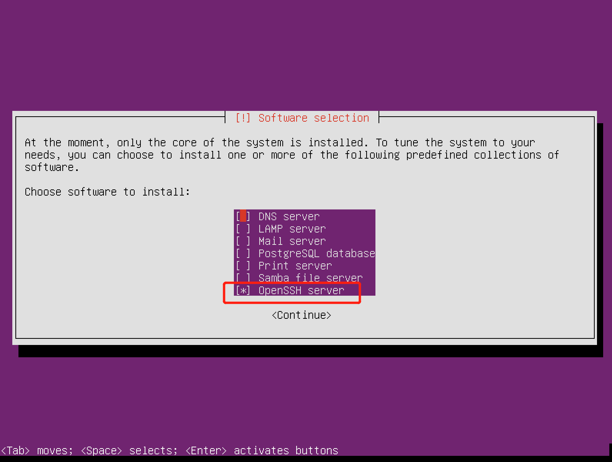
如下图所示安装成功并备份。
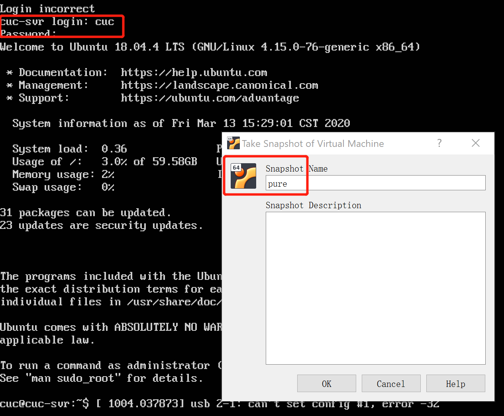
2. 实现开机自动启用和自动获取IP。    
```ifconfig -a```查看ip地址，此处得到：192.168.56.108。如下图修改'/etc/netplan/01-netcfg.yaml'保存退出后``` sudo netplan apply```，由于本次实验用不到更多，只进行了简单更改。
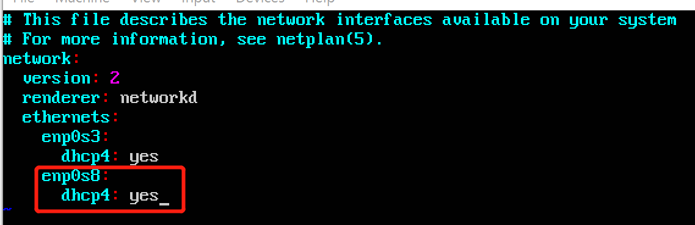
3. 配置ssh服务。  
由于安装时已选择openssh-server,此时不必在选择。在物理机上输入以下命令实现免密登录。
```
#生成密钥对
ssh-keygen -t rsa
#将公钥发送至服务器
ssh-copy-id cuc@192.168.56.108
#需输入密码
#免密登录
ssh cuc@192.168.56.108
```
如下图所示为成功ssh。
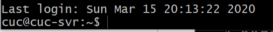
4. 制作iso。
* [ubuntu-server-autoinstall.seed](https://github.com/c4pr1c3/LinuxSysAdmin/blob/master/exp/chap0x01/cd-rom/preseed/ubuntu-server-autoinstall.seed#L18)
```
# 在当前用户目录下创建一个用于挂载iso镜像文件的目录
mkdir loopdir

# 挂载iso镜像文件到该目录
mount -o loop ubuntu-18.04.4-server-amd64.iso loopdir

# 创建一个工作目录用于克隆光盘内容
mkdir cd
 
# 同步光盘内容到目标工作目录
# 一定要注意loopdir后的这个/，cd后面不能有/
rsync -av loopdir/ cd

# 卸载iso镜像
umount loopdir

# 进入目标工作目录
cd cd

# 编辑Ubuntu安装引导界面增加一个新菜单项入口
vim isolinux/txt.cfg

#[置顶]添加以下内容到该文件后保存退出(放在文件最开始处)
label autoinstall
  menu label ^Auto Install Ubuntu Server
  kernel /install/vmlinuz
  append  file=/cdrom/preseed/ubuntu-server-autoinstall.seed debian-installer/locale=en_US console-setup/layoutcode=us keyboard-configuration/layoutcode=us console-setup/ask_detect=false localechooser/translation/warn-light=true localechooser/translation/warn-severe=true initrd=/install/initrd.gz root=/dev/ram rw quiet

# 修改配置缩短超时等待时间
# timeout 10
sudo vi isolinux/isolinux.cfg

# 将ubuntu-server-autoinstall.seed以ssh的方式拷贝到ubuntu系统
# 移动到指定目录下
sudo mv ubuntu-server-autoinstall.seed ~/cd/preseed/

# 重新生成md5sum.txt
find . -type f -print0 | xargs -0 md5sum > /tmp/md5sum.txt
sudo mv /tmp/md5sum.txt md5sum.txt

#打开shell脚本
vim shell

# 封闭改动后的目录到.iso
IMAGE=custom.iso
BUILD=~/cd/

mkisofs -r -V "Custom Ubuntu Install CD" \
            -cache-inodes \
            -J -l -b isolinux/isolinux.bin \
            -c isolinux/boot.cat -no-emul-boot \
            -boot-load-size 4 -boot-info-table \
            -o $IMAGE $BUILD

# 查找并安装相应的软件包
apt-cache search mkisofs
sudo apt install genisoimage

#执行shell脚本 进行镜像刻录
bash shell
```
镜像制作成功
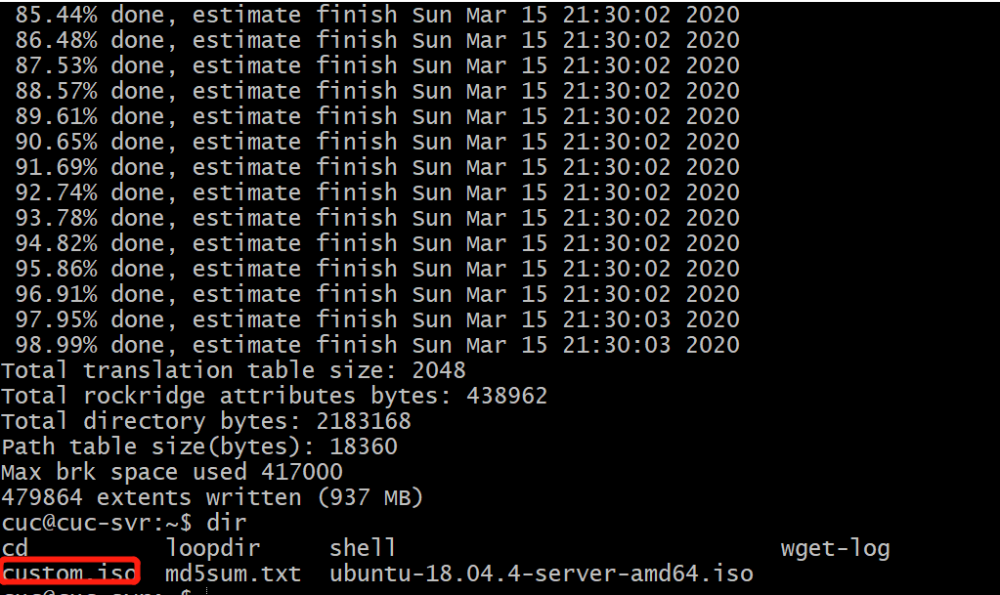
5. 将制作好的custom.iso拷贝到物理机，并安装,安装后使用ubuntu-server-autoinstall.seed中设置好的用户名和密码登录。
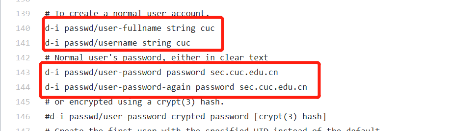
## 实验结果
>video/linux无人值守安装iso.mp4  

[在线视频](https://www.bilibili.com/video/BV1i7411f7jq)
## 实验结论
1. server版的ubuntu如何从命令行挂载Virtualbox的虚拟光驱中镜像？  
答：使用[mount](https://www.cnblogs.com/itech/archive/2009/08/07/1541061.html)。
2. server版的ubuntu如何安装Virtualbox增强功能套件？  
答：[Ubuntu-server安装VirtualBox增强功能](https://juejin.im/post/5d423d5f6fb9a06acc00637f)
3. server版的ubuntu如何从命令行挂载Virtualbox的共享目录？  
答：[Ubuntu-server安装VirtualBox增强功能后设置共享文件夹](https://juejin.im/post/5d423d5f6fb9a06acc00637f)
4. 做了哪些修改？这些修改的作用是什么？  
答：使用[在线比对工具](http://www.jq22.com/textDifference)，修改对比结果如下：
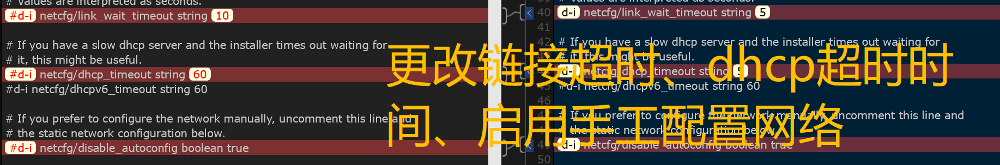
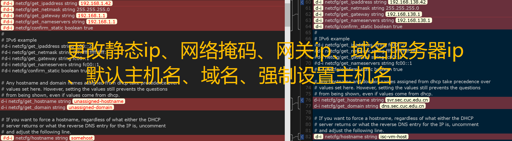
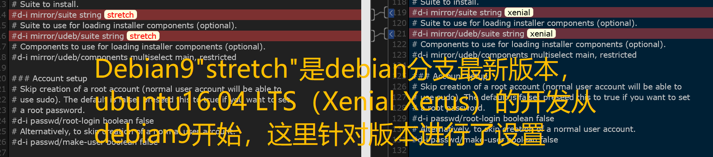
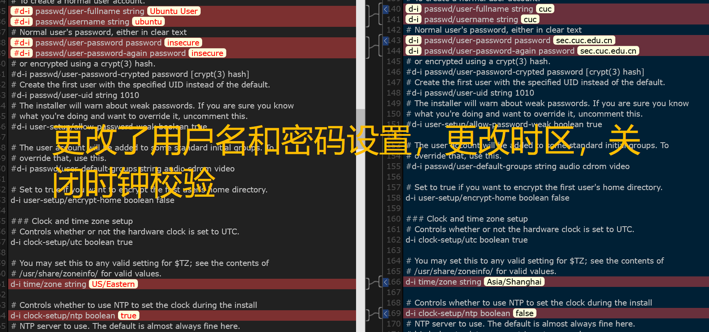
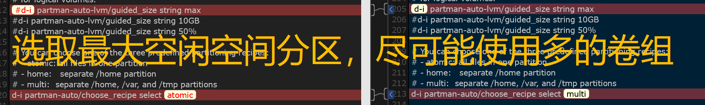
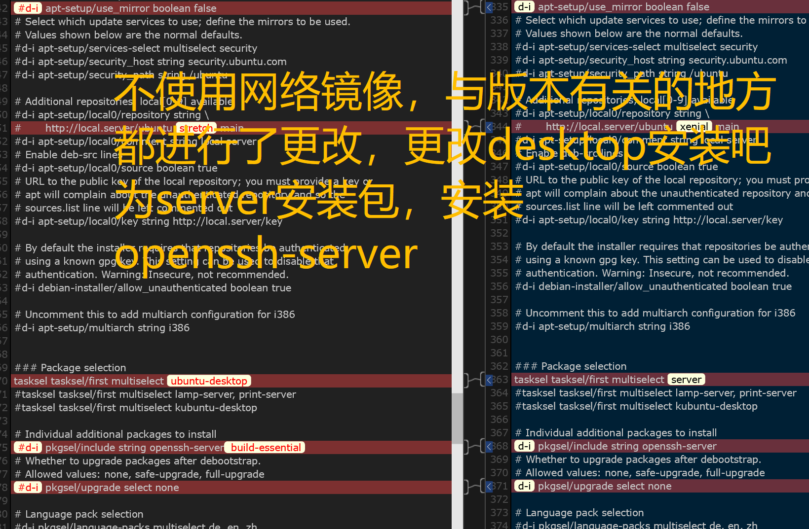
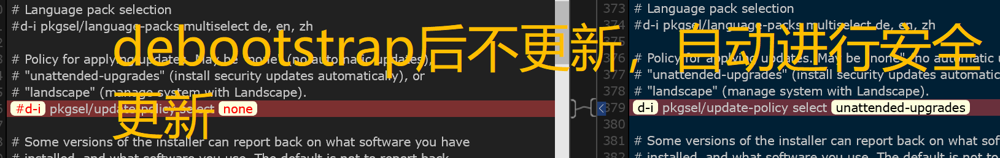
## 实验问题
1. 最后安装出现了这样的报错
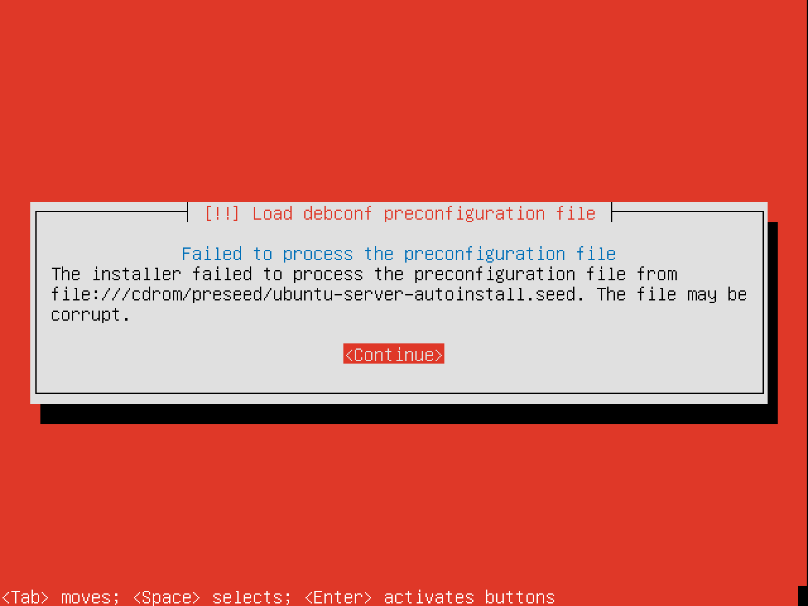
查看制作custom.iso的cd文件夹下是有ubuntu-server-autoinstall.seed文件的，文件来自老师github连接没有改动过。
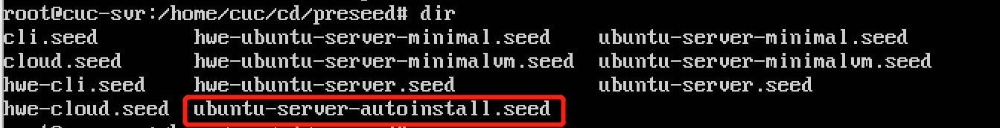
解决：下载ubuntu-server-autoinstall.seed时出了错，下载成了.html文件，以致于所有的都错了，重新做了一遍实验。```rm -rf```删目录我记得很清晰了。
## 实验扩展
SSH跳板登录
### 实验环境
本机windows-git-bash  
跳板机：kali-192.168.56.105  
靶机：ubuntu-192.168.56.108
```
ssh username@目标机器IP -p 22 -J username@跳板机IP:22
```
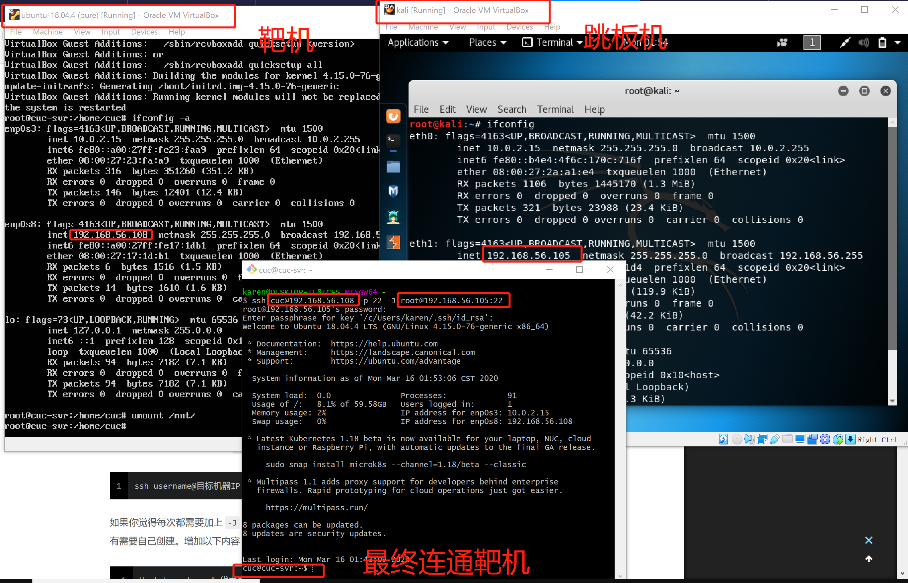 
## 参考文献
[Netplan configuration examples](https://netplan.io/examples)  
[师姐的实验](https://github.com/CUCCS/linux-2019-jckling/tree/master/0x01)  
[SSH 通过跳板机直接访问内网机器](https://woodenrobot.me/2019/07/18/ssh-proxyjump/)