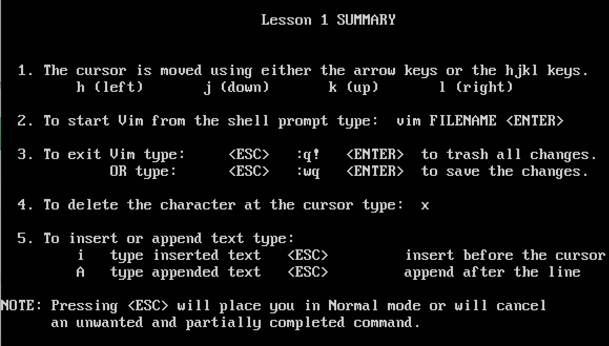
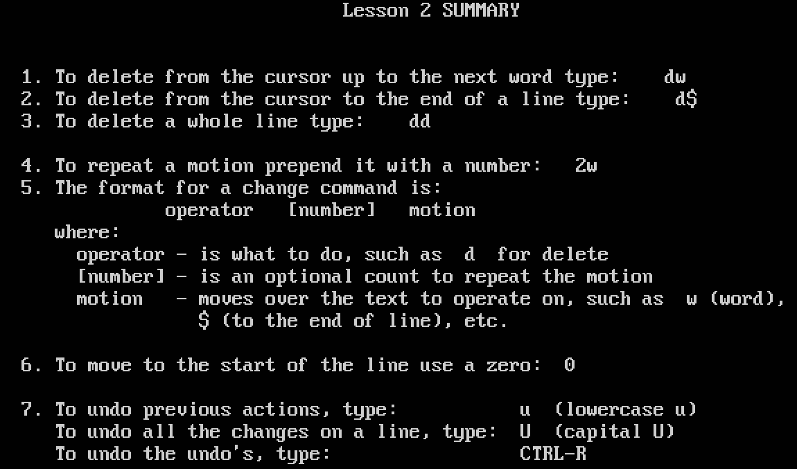
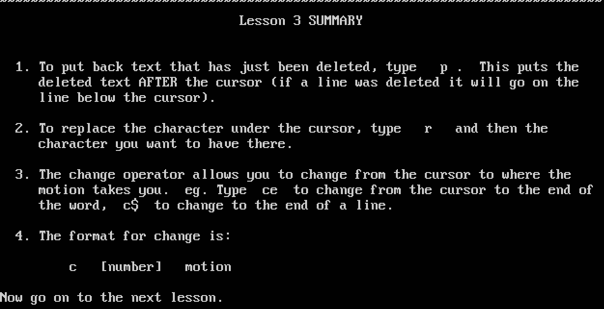
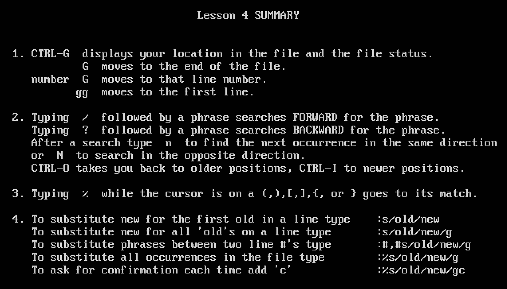
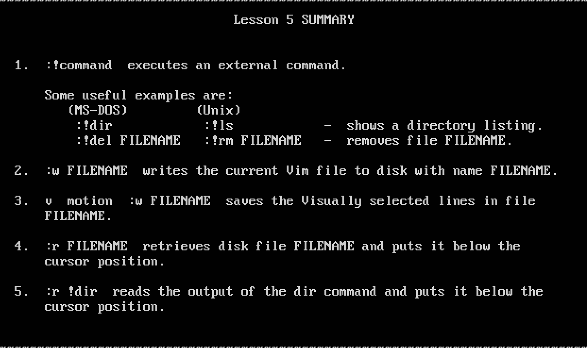
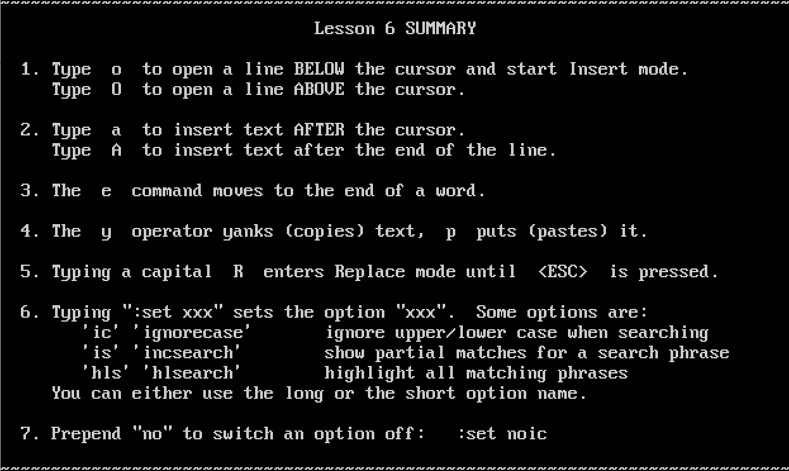
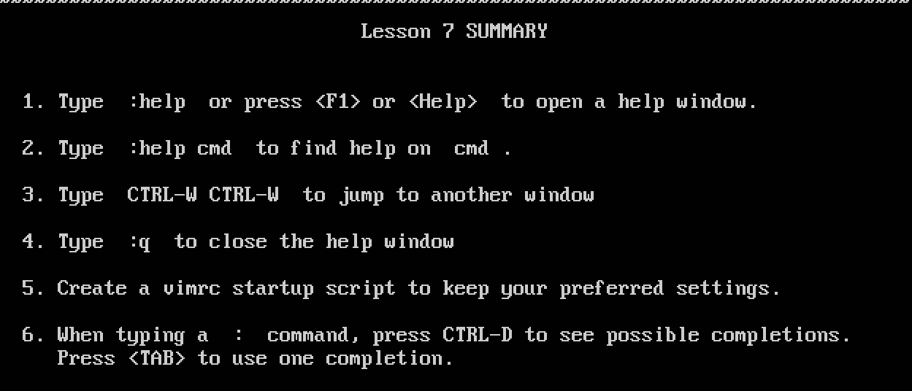
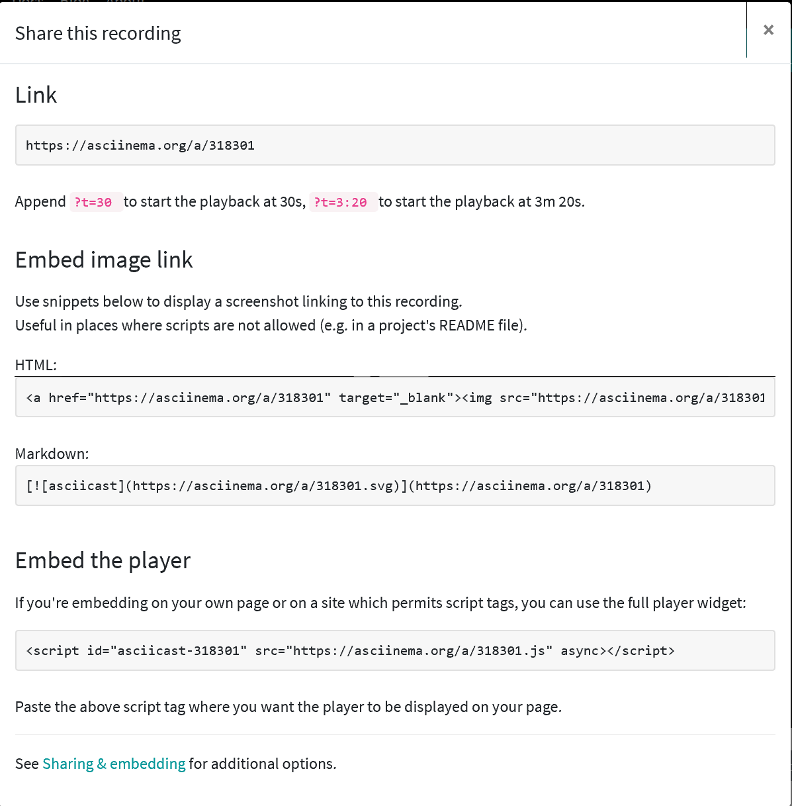

# Linux 服务器系统使用基础
## 实验要求
- [x] 确保本地已经完成asciinema auth，并在asciinema成功关联了本地账号和在线账号
- [x] 上传本人亲自动手完成的vimtutor操作全程录像
- [x] 在自己的github仓库上新建markdown格式纯文本文件附上asciinema的分享URL

## 实验环境
Ubuntu 18.04 Server 64bit  
在asciinema注册一个账号，并在本地安装配置好asciinema
## 实验步骤
### 1. 使用asciinema
下载安装asciinema
```
# Install 
sudo apt install asciinema

# Link your install ID with your asciinema.org user account
asciinema auth
```
asciinema基本操作
```
# 将终端记录到本地文件
asciinema rec demo.cast 
# 将终端记录到本地文件，将空闲时间限制到最大2.5秒
asciinema rec -i 2.5 demo.cast
# 从本地文件重放终端记录
asciinema play demo.cast
# 上传
asciinema upload demo.cast
```
### 2. 跟随vimtutor学习vim使用  
#### Lesson-1
<a href="https://asciinema.org/a/318303" target="_blank"></a> 
##### Lesson-1课程总结

#### Lesson-2
<a href="https://asciinema.org/a/318304" target="_blank"></a>
Lesson-2课程总结


#### Lesson-3
<a href="https://asciinema.org/a/318307" target="_blank"></a> 

##### Lesson-3课程总结


#### Lesson-4
<a href="https://asciinema.org/a/318309" target="_blank"></a> 

##### Lesson-4课程总结


#### Lesson-5
<a href="https://asciinema.org/a/318310" target="_blank"></a> 

##### Lesson-5课程总结


#### Lesson-6
<a href="https://asciinema.org/a/318311" target="_blank"></a>

##### Lesson-6课程总结

#### Lesson-7
<a href="https://asciinema.org/a/318312" target="_blank"></a>

##### Lesson-7课程总结


## 实验问题
1. 如何在markdown格式纯文本文件附上asciinema的分享URL?(以vim-lesson1的链接为例)
* github要使用html的方式

2. 学习lesson4单词替换时遇到问题，
解决：输入的是```:s/old/new```而不是```s/old/new```
## 实验总结
### vimtutor完成后的自查清单
1. 你了解vim有哪几种工作模式？  
Normal、Insert、Visual、Select、Command-line、Ex-mode
2. Normal模式下，从当前行开始，一次向下移动光标10行的操作方法？如何快速移动到文件开始行和结束行？如何快速跳转到文件中的第N行？    
光标向下移动10行：10j  
开始行：gg  
结束行：G  
第N行：Ngg、NG  
3. Normal模式下，如何删除单个字符、单个单词、从当前光标位置一直删除到行尾、单行、当前行开始向下数N行？  
删除单个字符：x  
删除单个单词：dw  
删除到行尾：d$  
删除单行：dd  
删除往下N行：dNd或Ndd  
4. 如何在vim中快速插入N个空行？如何在vim中快速输入80个-？  
插入N个空行：NO ESC  
快速插入80个-：插入模式下 CTRL-O 80i- ESC 
execute one command, return to Insert mode i_CTRL-O
5. 如何撤销最近一次编辑操作？如何重做最近一次被撤销的操作？  
撤销：u或U  
重做：Ctrl+R
6. vim中如何实现剪切粘贴单个字符？单个单词？单行？如何实现相似的复制粘贴操作呢？  
剪切单个字符：x  
剪切单个单词：dw  
剪切单行：d$  
粘贴：P/p  
7. 为了编辑一段文本你能想到哪几种操作方式（按键序列）？    
c:改变  
r/R:替换  
y+p:复制粘贴  
i:插入  
s:替换
8. 查看当前正在编辑的文件名的方法？查看当前光标所在行的行号的方法？  
Ctrl-G
9. 在文件中进行关键词搜索你会哪些方法？如何设置忽略大小写的情况下进行匹配搜索？如何将匹配的搜索结果进行高亮显示？如何对匹配到的关键词进行批量替换？  
/pattern  
:set ignorecase  
:set hlsearch 设置高亮查找  
:%s/old/new/g 将当前文件中全替换old为new  
10. 在文件中最近编辑过的位置来回快速跳转的方法？  
Normal Mode下：CTRL-O和CTRL-I
11. 如何把光标定位到各种括号的匹配项？例如：找到(, [, or {对应匹配的),], or }
光标挪至要匹配的符号处，再按%
12. 在不退出vim的情况下执行一个外部程序的方法？  
输入```:!+命令```
13. 如何使用vim的内置帮助系统来查询一个内置默认快捷键的使用方法？如何在两个不同的分屏窗口中移动光标？  
查看帮助使用快捷键：```:help 快捷键```    
不同的分屏窗口中移动光标：   
CTRL+W+h/j/k/l，光标在不同的分屏中移动  
CTRL+W+H/J/K/L，将光标所在的分屏移动到最左/下/上/右  
gt到下一个tab    
gT到上一个tab
### 自我总结
* Linux的操作习得更多
* 在vimtutor最后了解到了vim与vi的区别
## 实验拓展
### 本次学习对于linux基本操作的新知总结
```
# 安装sl
sudo apt update
sudo apt upgrade
sudo apt install sl

apt-cache policy #安装前如何确认软件包的版本、来源
apt show # 详细信息

man dpkg # 帮助手册

ls -a # 查看隐藏文件

stat #主要用于显示文件或文件系统的状态，详细信息
touch #命令可以创建一个空文件，主要就是用来修改文件的访问时间和修改时间
```
### 查看源版本并更换源
编辑配置文件即可  
```sudo vi /etc/apt/sources.list```
## 参考文献
[asciinema](https://asciinema.org/docs/how-it-works)  
[vimtutor](https://linux.die.net/man/1/vimtutor)