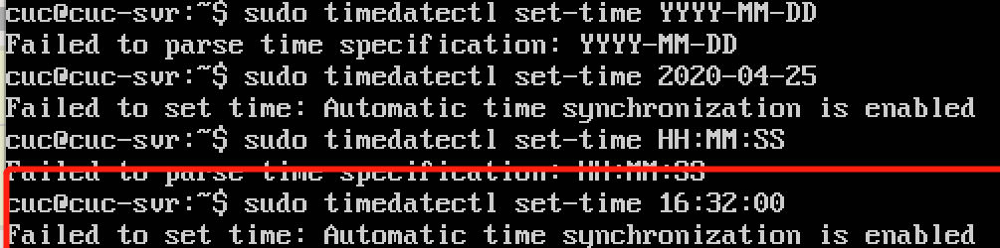

# 开机自启动项管理
## 实验要求
- [x] systemd 操作全程录像
- [x] 自查清单
## 实验环境
Ubuntu18.04 Server  
网卡：NAT、Host-Only  
镜像：ubuntu-18.04.1-server-amd64.iso  
  
## 实验步骤

### Systemd学习
systemd设计目标：为系统的启动和管理提供一套完整的解决方案。  
Systemd 的优点是功能强大，使用方便，缺点是体系庞大，非常复杂。  
当前systemd版本如下图所示：  


* 由于[Systemd 入门教程：实战篇](http://www.ruanyifeng.com/blog/2016/03/systemd-tutorial-part-two.html)是[Systemd 入门教程：命令篇](http://www.ruanyifeng.com/blog/2016/03/systemd-tutorial-commands.html)的实战分析，因此结合两篇文章完成以下实验。  

#### 1.系统管理
操作录像：    
<a href="https://asciinema.org/a/323813" target="_blank"></a>  

命令总结：
```
1.systemctl是 Systemd 的主命令，用于管理系统。
# 重启系统
$ sudo systemctl reboot
# 关闭系统，切断电源
$ sudo systemctl poweroff
# CPU停止工作
$ sudo systemctl halt
# 暂停系统
$ sudo systemctl suspend
# 让系统进入冬眠状态
$ sudo systemctl hibernate
# 让系统进入交互式休眠状态
$ sudo systemctl hybrid-sleep
# 启动进入救援状态（单用户状态）
$ sudo systemctl rescue

2.systemd-analyze命令用于查看启动耗时。
# 查看启动耗时
$systemd-analyze                                      
# 查看每个服务的启动耗时
$ systemd-analyze blame
# 显示瀑布状的启动过程流
$ systemd-analyze critical-chain
# 显示指定服务的启动流
$ systemd-analyze critical-chain atd.service

3.hostnamectl命令用于查看当前主机的信息。
# 显示当前主机的信息
$ hostnamectl
# 设置主机名。
$ sudo hostnamectl set-hostname mudou

4.localectl命令用于查看本地化设置。
# 查看本地化设置
$ localectl
# 设置本地化参数。
$ sudo localectl set-locale LANG=en_GB.utf8
$ sudo localectl set-keymap en_GB

5.timedatectl命令用于查看当前时区设置。
# 查看当前时区设置
$ timedatectl
# 显示所有可用的时区
$ timedatectl list-timezones                                             
# 设置当前时区
$ sudo timedatectl set-timezone America/New_York
$ sudo timedatectl set-time YYYY-MM-DD
$ sudo timedatectl set-time HH:MM:SS

6.loginctl命令用于查看当前登录的用户。
# 列出当前session
$ loginctl list-sessions
# 列出当前登录用户
$ loginctl list-users
# 列出显示指定用户的信息
$ loginctl show-user cuc
```
#### 2.Unit
操作录像：  
<a href="https://asciinema.org/a/323818" target="_blank"></a>  

* 12中Unit:  
Service unit：系统服务  
Target unit：多个 Unit 构成的一个组  
Device Unit：硬件设备  
Mount Unit：文件系统的挂载点  
Automount Unit：自动挂载点  
Path Unit：文件或路径  
Scope Unit：不是由   Systemd 启动的外部进程  
Slice Unit：进程组  
Snapshot Unit：Systemd 快照，可以切回某个快照  
Socket Unit：进程间通信的 socket  
Swap Unit：swap 文件  
Timer Unit：定时器  

命令总结：  
```
1.systemctl list-units命令可以查看当前系统的所有 Unit 。
# 列出正在运行的 Unit
$ systemctl list-units
# 列出所有Unit，包括没有找到配置文件的或者启动失败的
$ systemctl list-units --all
# 列出所有没有运行的 Unit
$ systemctl list-units --all --state=inactive
# 列出所有加载失败的 Unit
$ systemctl list-units --failed
# 列出所有正在运行的、类型为 service 的 Unit
$ systemctl list-units --type=service

2.systemctl status命令用于查看系统状态和单个 Unit 的状态。
# 显示系统状态
$ systemctl status
# 显示单个 Unit 的状态
$ systemctl status apache2.service
# 显示远程主机的某个 Unit 的状态
$ systemctl -H root@rhel7.example.com status httpd.service
# systemctl还提供了三个查询状态的简单方法，主要供脚本内部的判断语句使用。
# 显示某个 Unit 是否正在运行
$ systemctl is-active application.service
# 显示某个 Unit 是否处于启动失败状态
$ systemctl is-failed application.service
# 显示某个 Unit 服务是否建立了启动链接
$ systemctl is-enabled application.service

3.下面这些命令，用于启动和停止 Unit（主要是 service）
# 立即启动一个服务
$ sudo systemctl start apache2.service
# 立即停止一个服务
$ sudo systemctl stop apache2.service
# 重启一个服务
$ sudo systemctl restart apache2.service
# 杀死一个服务的所有子进程
$ sudo systemctl kill apache2.service
# 重新加载一个服务的配置文件
$ sudo systemctl reload apache2.service
# 重载所有修改过的配置文件
$ sudo systemctl daemon-reload
# 显示某个 Unit 的所有底层参数
$ systemctl show apache2.service
# 显示某个 Unit 的指定属性的值
$ systemctl show -p CanReload apache2.service
# 设置某个 Unit 的指定属性
$ sudo systemctl set-property httpd.service CPUShares=500

4.依赖关系
#systemctl list-dependencies命令列出一个 Unit 的所有依赖。
$ systemctl list-dependencies nginx.service
#有些依赖是 Target 类型（详见下文），默认不会展开显示。如果要展开 Target，就需要使用--all参数。
$ systemctl list-dependencies --all nginx.service
```
#### 3.Unit 的配置文件
操作录像：  
<a href="https://asciinema.org/a/323824" target="_blank"></a>  

命令总结：
```
1.每一个 Unit 都有一个配置文件，告诉 Systemd 怎么启动这个 Unit 。
Systemd 默认从目录/etc/systemd/system/读取配置文件。但是，里面存放的大部分文件都是符号链接，指向目录/usr/lib/systemd/system/，真正的配置文件存放在那个目录。
systemctl enable命令用于在上面两个目录之间，建立符号链接关系。
$ sudo systemctl enable clamd@scan.service
# 等同于
$ sudo ln -s '/usr/lib/systemd/system/clamd@scan.service' '/etc/systemd/system/multi-user.target.wants/clamd@scan.service'

2.systemctl list-unit-files命令用于列出所有配置文件。
# 列出所有配置文件
$ systemctl list-unit-files
# 列出指定类型的配置文件
$ systemctl list-unit-files --type=service
#每个配置文件的状态，一共有四种:
enabled：已建立启动链接
disabled：没建立启动链接
static：该配置文件没有[Install]部分（无法执行），只能作为其他配置文件的依赖
masked：该配置文件被禁止建立启动链接
# 从配置文件的状态无法看出是否运行，使用systemctl status命令。
$ systemctl status bluetooth.service
# 一旦修改配置文件，就要让 SystemD 重新加载配置文件，然后重新启动，否则修改不会生效
$ sudo systemctl daemon-reload
$ sudo systemctl restart httpd.service

3. 配置文件的格式
systemctl cat命令可以查看配置文件的内容。

4. 配置文件的区块
配置文件的区块名和字段名，都是大小写敏感的。
```
#### 4.Target
* Target 就是一个 Unit 组，包含许多相关的 Unit 。启动某个 Target 的时候，Systemd 就会启动里面所有的 Unit。从这个意义上说，Target 这个概念类似于"状态点"，启动某个 Target 就好比启动到某种状态

操作录像：    
<a href="https://asciinema.org/a/323826" target="_blank"></a>  

命令总结：  
```
# 查看当前系统的所有 Target
$ systemctl list-unit-files --type=target
# 查看一个 Target 包含的所有 Unit
$ systemctl list-dependencies multi-user.target
# 查看启动时的默认 Target
$ systemctl get-default
# 设置启动时的默认 Target
$ sudo systemctl set-default graphical.target
# 切换 Target 时，默认不关闭前一个 Target 启动的进程，
# systemctl isolate 命令改变这种行为，
# 关闭前一个 Target 里面所有不属于后一个 Target 的进程
$ sudo systemctl isolate multi-user.target
```
#### 5.日志管理
* journalctl查看所有日志（内核日志和应用日志）。日志的配置文件是/etc/systemd/journald.conf。

操作录像：    
<a href="https://asciinema.org/a/323829" target="_blank"></a>  

命令总结：  
```
# 查看所有日志（默认情况下 ，只保存本次启动的日志）
$ sudo journalctl
# 查看内核日志（不显示应用日志）
$ sudo journalctl -k
# 查看系统本次启动的日志
$ sudo journalctl -b
$ sudo journalctl -b -0
# 查看上一次启动的日志（需更改设置）
$ sudo journalctl -b -1
# 查看指定时间的日志
$ sudo journalctl --since="2012-10-30 18:17:16"
$ sudo journalctl --since "20 min ago"
$ sudo journalctl --since yesterday
$ sudo journalctl --since "2015-01-10" --until "2015-01-11 03:00"
$ sudo journalctl --since 09:00 --until "1 hour ago"
# 显示尾部的最新10行日志
$ sudo journalctl -n
# 显示尾部指定行数的日志
$ sudo journalctl -n 20
# 实时滚动显示最新日志
$ sudo journalctl -f
# 查看指定服务的日志
$ sudo journalctl /usr/lib/systemd/systemd
# 查看指定进程的日志
$ sudo journalctl _PID=1
# 查看某个路径的脚本的日志
$ sudo journalctl /usr/bin/bash
# 查看指定用户的日志
$ sudo journalctl _UID=33 --since today
# 查看某个 Unit 的日志
$ sudo journalctl -u nginx.service
$ sudo journalctl -u nginx.service --since today
# 实时滚动显示某个 Unit 的最新日志
$ sudo journalctl -u nginx.service -f
# 合并显示多个 Unit 的日志
$ journalctl -u nginx.service -u php-fpm.service --since today
# 查看指定优先级（及其以上级别）的日志，共有8级
# 0: emerg
# 1: alert
# 2: crit
# 3: err
# 4: warning
# 5: notice
# 6: info
# 7: debug
$ sudo journalctl -p err -b
# 日志默认分页输出，--no-pager 改为正常的标准输出
$ sudo journalctl --no-pager
# 以 JSON 格式（单行）输出
$ sudo journalctl -b -u nginx.service -o json
# 以 JSON 格式（多行）输出，可读性更好
$ sudo journalctl -b -u nginx.serviceqq
 -o json-pretty
# 显示日志占据的硬盘空间
$ sudo journalctl --disk-usage
# 指定日志文件占据的最大空间
$ sudo journalctl --vacuum-size=1G
# 指定日志文件保存多久
$ sudo journalctl --vacuum-time=1years
```
## 实验问题
1. [系统管理]学习录像中，设置时间失败，具体报错信息如下图所示：  
  
解决办法：[How can I disable automatic time syncing?[SOLVED]](https://bbs.archlinux.org/viewtopic.php?id=186323)
## 实验总结
1. 如何添加一个用户并使其具备sudo执行程序的权限？  
通过adduser username添加用户  
将username放到sudo用户组即可获得

2. 如何将一个用户添加到一个用户组？  
```sudo adduser username sudo```

3. 如何查看当前系统的分区表和文件系统详细信息？  
通过```sudo sfdisk -l```或```sudo cfdisk```查看分区表  
通过```df -a```或```stat -f```查看文件系统详细信息

4. 如何实现开机自动挂载Virtualbox的共享目录分区？ 
首先在vbox中打开添加共享文件夹,打开自动挂载和固定分配  
```sudo /media/cdrom/./VBoxLinuxAdditions.run```安装增强功能  
```sudo mount -t vboxsf shared ~/shared```将共享文件夹挂载到share目录    
virtualbox中的选项自动挂载可以实现开机自动挂载，也可以通过systemd实现    
编写文件my_mount-src_host.automount,内容如下：    
```
[Unit]
Description=Auto mount shared "src" folder

[Automount]
Where=~/shared
DirectoryMode=0775
Type=vboxsf

[Install]
WantedBy=multi-user.target
```
执行```systemd enable my_mount-src_host.automount```  

5. 基于LVM（逻辑分卷管理）的分区如何实现动态扩容和缩减容量？
```
#缩容
lvreduce --size size dir
#扩容
lvextend --size size dir
```

6. 如何通过systemd设置实现在网络连通时运行一个指定脚本，在网络断开时运行另一个脚本？  
网络连通启动脚本配置,内容如下：
```
[Unit]
Description=After network up
After=network.target network-online.target 	
[Service]
Type=oneshot
ExecStart=_YOUR_SCRIPT_

[Install]
WantedBy=multi-user.target
```
网络断开启动脚本配置，将以上内容中的After改成Before  
7. 如何通过systemd设置实现一个脚本在任何情况下被杀死之后会立即重新启动？实现杀不死？  
创建service文件
```
 [Unit]
 Description=My Script
 
 [Service]
 Type=forking
 ExecStart=/usr/bin/MY_SCRIPT
 ExecStop=/usr/bin/MY_SCRIPT
 Restart=always
 RestartSec=1
 RemainAfterExit=yes
 
 [Install]
 WantedBy=multi-user.target
```
重新加载配置,并启动，其中在'MY_SCRIPT'中添加一句```systemd start my_script.service```,再次避免services被停止  
或者：编写对应的.service文件, 将[Service]区块的Restart字段设置为always即可
## 参考文献
[systemd](https://systemd.io/)  
[Systemd 入门教程：命令篇](http://www.ruanyifeng.com/blog/2016/03/systemd-tutorial-commands.html)  
[Systemd 入门教程：实战篇](http://www.ruanyifeng.com/blog/2016/03/systemd-tutorial-part-two.html)  
[systemd.unit](https://www.freedesktop.org/software/systemd/man/systemd.unit.html)