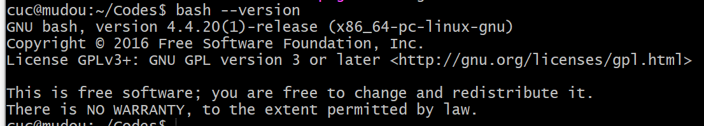

# Shell脚本编程基础

## 实验要求
- [x] 任务一：用bash编写一个图片批处理脚本，实现以下功能：
  1. 支持命令行参数方式使用不同功能
  2. 支持对指定目录下所有支持格式的图片文件进行批处理
  3. 支持以下常见图片批处理功能的单独使用或组合使用:
 * 1）支持对jpeg格式图片进行图片质量压缩  
 2）支持对jpeg/png/svg格式图片在保持原始宽高比的前提下压缩分辨率  
 3）支持对图片批量添加自定义文本水印  
 4）支持批量重命名（统一添加文件名前缀或后缀，不影响原始文件扩展名）  
 5）支持将png/svg图片统一转换为jpg格式图片  
- [x] 任务二：用bash编写一个文本批处理脚本，对以下附件分别进行批量处理完成相应的数据统计任务：
* 任务二的所有统计数据结果要求写入独立实验报告
* 附件-【2014世界杯运动员数据】
1. 统计不同年龄区间范围（20岁以下、[20-30]、30岁以上）的球员数量、百分比
2. 统计不同场上位置的球员数量、百分比
3. 名字最长的球员是谁？名字最短的球员是谁？
4. 年龄最大的球员是谁？年龄最小的球员是谁？
- [x] 任务三：用bash编写一个文本批处理脚本，对以下附件分别进行批量处理完成相应的数据统计任务：
* 附件-【Web服务器访问日志】
1. 统计访问来源主机TOP 100和分别对应出现的总次数
2. 统计访问来源主机TOP 100 IP和分别对应出现的总次数
3. 统计最频繁被访问的URL TOP 100
4. 统计不同响应状态码的出现次数和对应百分比
5. 分别统计不同4XX状态码对应的TOP 10 URL和对应出现的总次数
6. 给定URL输出TOP 100访问来源主机
* 上述任务的所有源代码文件必须单独提交并提供详细的–help脚本内置帮助信息
## 实验环境
ubuntu 18.04 server+bash 4.4.20  

## 课内实验
### 0

```bash
#!/usr/bin/env bash

echo "hello world!"
```

```bash
# 查看当前正在使用shell解释器
ps | grep $$

# 查看当前shell解释器对应的文件绝对路径
type bash

# 查看当前bash的版本号
bash --version

# shell 内置帮助
help type
help help
```

### 1
```bash
#!/usr/bin/env bash
PRICE_PER_APPLE=5
echo "The price of an Apple today is: \$HK $PRICE_PER_APPLE"

MyFirstLetters=ABC
echo "The first 10 letters in the alphabet are: ${MyFirstLetters}DEFGHIJ"

greeting='Hello        world!'
echo $greeting" now with spaces: $greeting"     # 此处实际上实现了一个字符串 拼接/连接 操作

# 其他程序的输出结果直接赋值给shell变量
FILELIST=`ls`
FileWithTimeStamp=$(/bin/date +%Y-%m-%d).txt

echo $FILELIST
echo $FileWithTimeStamp
```

### 2

```bash
#!/usr/bin/env bash
# 代码填空，使用最终输出3个包含correct的语句
BIRTHDATE='Jan 1 2000'   # 填入一个字符串
Presents=10    # 填入一个整数
BIRTHDAY=$(/bin/date -d "$BIRTHDAY" +%A)    # 使用命令替换方法赋值


# 测试代码 - 勿修改

if [ "$BIRTHDATE" == "Jan 1 2000" ] ; then
    echo "BIRTHDATE is correct, it is $BIRTHDATE"
else
    echo "BIRTHDATE is incorrect - please retry"
fi
if [ $Presents == 10 ] ; then
    echo "correct! I have received $Presents presents"
else
    echo "Presents is incorrect - please retry"
fi
if [ "$BIRTHDAY" == "Saturday" ] ; then
    echo "correct! I was born on a $BIRTHDAY"
else
    echo "BIRTHDAY is incorrect - please retry"
```

### 3 调试

```bash
# 调试模式运行，逐行执行“命令”并打印“命令”接受的输入参数值
$ bash -x <script.sh>

# 代码片段临时开启调试模式
set -x          # activate debugging from here
w
set +x          # stop debugging from here

# 写文件
echo -e "$msg"

# 如果打印变量内容包含「不可打印字符」
# msg="hello world\x01\x02"
echo -n -e "$msg" | xxd -p
```

### 4 传参

`bash 4.sh apple 5 banana 8 "Fruit Basket" 15`

```bash
# $0 指代脚本文件本身
# $1 指代命令行上的第1个参数
# $2 指代命令行上的第2个参数，以此类推其他参数的脚本内引用方法
# $@ 指代命令行上的所有参数（参数数组）
# $# 指代命令行上的参数个数（参数数组大小）

#!/usr/bin/env bash

echo $3 # --> results with: banana

BIG=$5

echo "A $BIG costs just $6"

# 输出所有参数
echo "$@"

# 以下代码输出命令行参数的总数
echo $#
```

### 5 数组

```bash
#!/usr/bin/env bash

# 查看当前 Bash 的 declare 支持的参数
# help declare

# 声明一个「索引」数组
declare -a indexed_arr

# 声明一个「关联」数组
declare -A associative_arr

# Bash 数组赋值方法如下
# 「索引」数组可以跳过数组声明直接赋值的同时即完成了数组初始化
my_array=(apple banana "Fruit Basket" orange)

associative_arr['hello']='world'
associative_arr['well']='done'

# bash支持“稀疏”数组：即数组元素不必连续存在，个别索引位置上可以有未初始化的元素
new_array[2]=apricot

# 数组元素的个数通过 ${#arrayname[@]} 获得
echo ${#my_array[@]}

# 随机读取数组中的元素，必须有{}
echo ${my_array[2]}

# 遍历数组的方法
## 「索引」数组
for ele in "${my_array[@]}";do
    echo "$ele"
done

## 「关联」数组
for key in "${!associative_arr[@]}";do
    echo "$key ${associative_arr[$key]}"
done
```

### 6 数组代码填空

```bash
#!/usr/bin/env bash
NAMES=( John Eric Jessica )

# 代码填空，使得以下代码避免输出failed关键字
NUMBERS=(1 2 3 4 5 6 7 8 9 10)  # 构造包含1到10整数的数组
STRINGS=(hello world)  # 构造分别包含hello和world字符串的数组
NumberOfNames=${#NAMES[@]} # 请使用动态计算数组元素个数的方法
second_name=${NAMES[1]}  # 读取NAMES数组的第2个元素值进行赋值

# 测试代码 - 勿修改

T_NUMBERS=$(seq 1 10)
T_STRINGS=(hello world)

# Test Case 1
i=0
for n in ${T_NUMBERS[@]};do
  if [[ ${n} -ne ${NUMBERS[${i}]} ]];then
    echo "failed in NUMBERS test"
  fi
  i=$((i+1))
done

# Test Case 2
i=0
for n in ${T_STRINGS[@]};do
  if [[ "${n}" != "${STRINGS[${i}]}" ]];then
    echo "failed in STRINGS test"
  fi
  i=$((i+1))
done

# Test Case 3
if [[ $NumberOfNames -ne ${#NAMES[@]} ]];then
    echo "failed in NumberOfNames test"
fi

# Test Case 4
if [[ "${NAMES[1]}" != "${second_name}" ]];then
  echo "failed in Array Element Access test"
fi
```

### 7 算术运算

```bash
#!/usr/bin/env bash

# 使用 $((expression)) 算术运算符表达式，注意这种方式只支持 整数运算
A=3
B=$((100 * A + 5)) # 305
echo $B

# 计算 4 * arctangent(1) ，计算结果保留 10 位有效数字
# -l 表示使用标准数学库
pi=$(echo "scale=10; 4*a(1)" | bc -l)
echo $pi

# 计算 4 * arctangent(1) ，计算结果保留 1000 位有效数字
# 禁止输出结果因超长而自动折行
pi=$(BC_LINE_LENGTH=0 bc -l <<< "scale=1000; 4*a(1)")
echo $pi
```

### 8 字符串操作

```bash
#!/usr/bin/env bash

# 获得字符串长度值
STRING="this is a string"
echo ${#STRING}            # 16

# 注意非拉丁语系字符串长度计算
M_STRING="中文"
export LANG=C.UTF-8
echo ${#M_STRING}            # 2
export LANG=C
echo ${#M_STRING}            # 6

# 字符串截取子串
STRING="this is a string"
POS=1
LEN=3
echo ${STRING:$POS:$LEN}   # his
echo ${STRING:1}           # $STRING contents without leading character
echo ${STRING:12}          # ring

# 注意非拉丁语系字符串截取
export LANG=C
echo -n "${M_STRING:0:1}" | xxd -p # e4
export LANG=C.UTF-8
echo -n "${M_STRING:0:1}" | xxd -p # e4b8ad

# 字符串查找并替换第一次匹配到的子串
STRING="to be or not to be"
echo ${STRING[@]/be/eat}   # to eat or not to be
```

### 9 字符串替换

```bash
#!/usr/bin/env bash

# 字符串查找并替换所有匹配到的子串
STRING="to be or not to be"
echo ${STRING[@]//be/eat}  # to eat or not to eat

# 字符串查找并删除（替换为空）所有匹配到的子串
STRING="to be or not to be"
echo ${STRING[@]// not/}        # to be or to be

# 字符串查找并替换匹配到行首的子串
STRING="to be or not to be"
echo ${STRING[@]/#to be/eat now}    # eat now or not to be

# 字符串查找并替换匹配到行尾的子串
STRING="to be or not to be"
echo ${STRING[@]/%be/eat}        # to be or not to eat

# 字符串查找并使用子命令输出结果替换匹配项
STRING="to be or not to be"
echo ${STRING[@]/%be/be on $(date +%Y-%m-%d)}
```

### 10 条件判断

```bash
#!/usr/bin/env bash
if [[ 0 ]];then printf "%d" 0;fi
if [[ 1 ]];then printf "%d" 1;fi
if [[ true ]];then printf "%d" 2;fi
if [[ false ]];then printf "%d" 3;fi
if [[ '' ]];then printf "%d" 4;fi
if [[ '   ' ]];then printf "%d" 5;fi
if [[ 'true' ]];then printf "%d" 6;fi
if [[ 'false' ]];then printf "%d" 7;fi
if [[ '$mamashuozhegebianliangbukenengdingyiguo' ]];then printf "%d" 8;fi
if [[ "$mamashuozhegebianliangbukenengdingyiguo" ]];then printf "%d" 9;fi
```

### 11 选择条件分支
```bash
#!/usr/bin/env bash
mycase=1
case $mycase in
    1) echo "You selected bash";;
    2) echo "You selected perl";;
    3) echo "You selected phyton";;
    4) echo "You selected c++";;
    5) exit
esac
```

### 12 for 循环

```bash
#!/usr/bin/env bash
# loop on array member
NAMES=(Joe Jenny Sara Tony)
for N in ${NAMES[@]} ; do
  echo "My name is $N"
done

# loop on command output results
for f in $(ps -eo command) ; do
  echo "$f"
done

# loop on command output results 健壮性改进版本
set -e
for f in $(ps -eo command 2>/dev/null) ; do
  [[ -e "$f" ]] || continue 
  ls "$f"
done

# 下面是改进前的「脆弱」版本，对比执行找不同
set -e
for f in $(ps -eo command) ; do
  ls "$f"
done
```

### 13 while 循环

```bash
#!/usr/bin/env bash
COUNT=4
while [ $COUNT -gt 0 ]; do
  echo "Value of count is: $COUNT"
  COUNT=$(($COUNT - 1))
done

COUNT=4
while [ : ]; do
  echo "Value of count is: $COUNT"
  COUNT=$(($COUNT - 1))
  if [[ $COUNT -eq 0 ]];then
     break
  fi
done
```

### 14 until循环

条件为假时，执行循环体内代码。为真时，跳过循环体代码段

```bash
#!/usr/bin/env bash
COUNT=1
until [ $COUNT -gt 5 ]; do
  echo "Value of count is: $COUNT"
  COUNT=$(($COUNT + 1))
done
```

### 15 break和continue

```bash
#!/usr/bin/env bash

# Prints out 0,1,2,3,4

COUNT=0
while [ $COUNT -ge 0 ]; do
  echo "Value of COUNT is: $COUNT"
  COUNT=$((COUNT+1))
  if [ $COUNT -ge 5 ] ; then
    break
  fi
done

# Prints out only odd numbers - 1,3,5,7,9
COUNT=0
while [ $COUNT -lt 10 ]; do
  COUNT=$((COUNT+1))
  # Check if COUNT is even
  if [ $(($COUNT % 2)) = 0 ] ; then
    continue
  fi
  echo $COUNT
done
```

### FAIL-FAST：避免错误蔓延

```bash
# 脚本只要发生错误，就终止执行
# 不能终止管道命令中执行出错的语句
# 只要最后一个子命令不失败，管道命令总是会执行成功
set -e

# 关闭 -e 选项
set +e

# 让脚本在更严格的条件下执行
set -eo pipefail
```

SHELL脚本静态分析工具 - shellcheck

### 16 函数

function关键字是可选的，主要区别在于可移植性

```bash
# 基本定义方法，可移植性最好
function_name () compound-command [ redirections ]

# 现代主流shell解释权均支持的语法，可以避免alias机制污染函数名
function function_name [()] compound-command [ redirections ]
```

```bash
#!/usr/bin/env bash
function function_B {
  echo "Function B."
}
function function_A {
  echo "$1"
}
function adder {
  echo "$(($1 + $2))"
}

# 调用函数，传参
function_A "Function A."     # Function A.
function_B                   # Function B.
adder 12 56                  # 68
```

### gcd
** 求最大公约数 **
- 通过命令行参数读取2个整数，对不符合参数调用规范（使用小数、字符、少于2个参数等）的脚本执行要给出明确的错误提示信息，并退出代码执行

求两个正整数的最大公因子

```bash
#!usr/bin/env bash

if [ $# -lt 2 ]
then
  echo "Please input two integer"
  exit -1
elif [[ "$1" == *[!0-9]* || "$2" == *[!0-9]* ]]
then
  echo "Not number or not intrger"
  exit -1
elif [[ "$1" -lt 1 || "$2" -lt 1 ]]
then
  echo "Number should greater than 1"
  exit -1
fi

if [ "$1" -gt "$2" ]
then
  a=$1
  b=$2
else
  a=$2
  b=$1
fi

while [ "$b" -ne 0 ]; do
  remainder=$(( "$a" % "$b" ))
  a=$b
  b=$remainder
done

echo "GCD of $1 and $2 is $a"
exit 0
```

### 17 特殊变量、文件读写

特殊变量

```bash
$0 # 当前脚本的文件名
$n # 脚本或函数的第N个传入参数
$# # 脚本或函数传入参数的个数
$@ # 脚本或函数传入的所有参数（数组形式）
$* # 脚本或函数传入的所有参数（字符串形式）
$? # 最近一条命令或函数的退出状态码
$$ # 当前shell解释器的进程编号，对脚本来说就是当前脚本解释器的进程编号
$! # 最近一个进入后台执行的进程的进程编号
```

文件读写

```bash
#!/usr/bin/env bash

# 利用I/O重定向机制

# 清空一个文件（文件大小变为0）
> file
# 用一段文本内容覆盖一个文件
echo "some string" > file
# 在文件尾部追加内容
echo "some string" >> file

# 读取文件的第一行并将其赋值给一个变量

# read是bash的内置函数
# read命令会从标准输入读取一行，并将其赋值给变量line。-r选项表示read将读取原生内容，所有字符都不会被转义，例如反斜线不会用于转义（只是反斜线）。输入重定向命令"<file"会打开文件并执行读操作，并且会将读取的内容以标准输入的形式提供给read命令。
read -r line < file
# read命令会删除特殊变量IFS所表示的字符。IFS是Internal Field Separator（内部字段分隔符）的缩写，它的值为用于分隔单词和行的字符组成的字符串。IFS的默认值为空格符、制表符和换行符组成的字符串。这意味着前导和尾随的空格符和制表符都会被删除。如果你想保留这些字符，你可以将IFS设置为空字符：
IFS= read -r line < file
# 利用外部程序head
line=$(head -1 file)
line=`head -1 file`

# 构造一个「畸形」测试用例
echo -n -e " 123 \x0a456" > file
# 逐行读文件 **有 BUG**
while read -r line; do
      # do something with $line
      echo "$line" | xxd -p
done < file
# 逐行读文件，防止行两端的空白字符被删除 **依然有 BUG**
while IFS= read -r line; do
      # do something with $line
      echo "$line" | xxd -p
done < file
# 文件读写的最佳实践
while IFS= read -r line || [[ -n "$line" ]]; do
      # do something with $line
      echo "$line" | xxd -p
done < file
```

### 18 符号编码

- ` backtick/backquote 反引号
- [ square bracket 方括号
- ' single quote 单引号
- " double quote 双引号
- _ underscore 下划线
- / slash 斜线（URL、*NIX 路径分隔符）
- \ backslash 反斜线（转义符号、Windows 路径分隔符）

```bash
# 16进制表示的 ascii 码: 7c，英文术语：vertical bar，Shell编程里的“管道操作符”
printf '%s' '|' | xxd  

# ref: https://www.zhihu.com/question/21747929/answer/319675621
printf '%s' '丨' | xxd # 16进制表示的 ascii 码: e4b8a8，汉语拼音：gun

# ref: https://practicaltypography.com/hyphens-and-dashes.html
# 16进制表示的 ascii 码: 2d，英文术语：hyphen，中文术语：连字符，俗称：短杠
printf '%s' '-' | xxd 

# 16进制表示的 ascii 码: e28093，英文术语：en dash
printf '%s' '–' | xxd 

# 16进制表示的 ascii 码: e28094，这是中文输入法打出来的破折号的一半，英文术语：em dash
printf '%s' '—' | xxd 
```
## 实验步骤
### TASK1
>实验代码：code/task1.sh
0. 安装 ImageMagick 工具：```sudo apt install imagemagick-6.q16``` 
1. 显示帮助信息：  
  
2. 对.jpeg图片进行质量压缩，看到确实图片进行了压缩。    

3. 对jpeg/png/svg格式图片在保持原始宽高比的前提下压缩分辨率  
  
4. 对图片批量添加自定义文本水印及批量重命名（统一添加文件名前缀或后缀，不影响原始文件扩展名）    
   
5. 支持将png/svg图片统一转换为jpg格式图片  

### TASK2
>实验代码：code/task2.sh 

>实验附件-【2014世界杯运动员数据】：code/worldcupplayerinfo.tsv

0. 帮助信息
1. 统计不同年龄区间范围（20岁以下、[20-30]、30岁以上）的球员数量、百分比
2. 统计不同场上位置的球员数量、百分比
3. 名字最长的球员是谁？名字最短的球员是谁？
4. 年龄最大的球员是谁？年龄最小的球员是谁？


### TASK3
>实验代码：code/task3.sh 


>实验附件-【Web服务器访问日志】：code/weblog.tsv
0. 帮助信息以及weblog.tsv中的数据信息

1. 统计访问来源主机TOP 100和分别对应出现的总次数
```bash task3.sh -a```
```
6530    edams.ksc.nasa.gov
4846    piweba4y.prodigy.com
4791    163.206.89.4
4607    piweba5y.prodigy.com
4416    piweba3y.prodigy.com
3889    www-d1.proxy.aol.com
3534    www-b2.proxy.aol.com
3463    www-b3.proxy.aol.com
3423    www-c5.proxy.aol.com
3411    www-b5.proxy.aol.com
3407    www-c2.proxy.aol.com
3404    www-d2.proxy.aol.com
3337    www-a2.proxy.aol.com
3298    news.ti.com
3296    www-d3.proxy.aol.com
3293    www-b4.proxy.aol.com
3272    www-c3.proxy.aol.com
3234    www-d4.proxy.aol.com
3177    www-c1.proxy.aol.com
3134    www-c4.proxy.aol.com
3123    intgate.raleigh.ibm.com
3088    www-c6.proxy.aol.com
3041    www-a1.proxy.aol.com
3011    mpngate1.ny.us.ibm.net
2983    e659229.boeing.com
2957    piweba1y.prodigy.com
2906    webgate1.mot.com
2761    www-relay.pa-x.dec.com
2318    beta.xerox.com
2311    poppy.hensa.ac.uk
2237    vagrant.vf.mmc.com
1910    palona1.cns.hp.com
1793    www-proxy.crl.research.digital.com
1762    koriel.sun.com
1681    derec
1637    trusty.lmsc.lockheed.com
1623    gw2.att.com
1563    cliffy.lfwc.lockheed.com
1503    inet2.tek.com
1485    disarray.demon.co.uk
1467    gw1.att.com
1435    128.217.62.1
1395    interlock.turner.com
1360    163.205.1.19
1354    sgigate.sgi.com
1336    bocagate.bocaraton.ibm.com
1324    piweba2y.prodigy.com
1311    gw3.att.com
1310    keyhole.es.dupont.com
1297    n1144637.ksc.nasa.gov
1292    163.205.3.104
1256    163.205.156.16
1252    163.205.19.20
1216    erigate.ericsson.se
1211    gn2.getnet.com
1089    gwa.ericsson.com
1079    tiber.gsfc.nasa.gov
1054    128.217.62.2
1017    bstfirewall.bst.bls.com
1015    163.206.137.21
1013    spider.tbe.com
1010    gatekeeper.us.oracle.com
995     www-c8.proxy.aol.com
984     whopkins.sso.az.honeywell.com
966     news.dfrc.nasa.gov
949     128.159.122.110
940     proxy0.research.att.com
925     proxy.austin.ibm.com
902     www-c9.proxy.aol.com
901     bbuig150.unisys.com
899     corpgate.nt.com
890     sahp315.sandia.gov
869     amdext.amd.com
848     128.159.132.56
830     n1121796.ksc.nasa.gov
825     igate.uswest.com
819     gatekeeper.cca.rockwell.com
815     wwwproxy.sanders.com
814     gw4.att.com
812     goose.sms.fi
808     128.159.144.83
805     jericho3.microsoft.com
798     128.159.111.141
786     jericho2.microsoft.com
782     sdn_b6_f02_ip.dny.rockwell.com
778     lamar.d48.lilly.com
776     163.205.11.31
772     heimdallp2.compaq.com
771     stortek1.stortek.com
762     163.205.16.75
759     mac998.kip.apple.com
742     tia1.eskimo.com
733     www-e1f.gnn.com
718     www-b1.proxy.aol.com
715     reddragon.ksc.nasa.gov
711     128.159.122.137
701     rmcg.cts.com
701     bambi.te.rl.ac.uk
697     electron.mcc.com
691     163.205.23.76
```
2. 统计访问来源主机TOP 100 IP和分别对应出现的总次数
```bash task3.sh -b```
```
4791    163.206.89.4
1435    128.217.62.1
1360    163.205.1.19
1292    163.205.3.104
1256    163.205.156.16
1252    163.205.19.20
1054    128.217.62.2
1015    163.206.137.21
949     128.159.122.110
848     128.159.132.56
808     128.159.144.83
798     128.159.111.141
776     163.205.11.31
762     163.205.16.75
711     128.159.122.137
691     163.205.23.76
672     206.27.25.1
647     198.83.19.44
641     199.1.50.225
624     163.205.23.93
610     139.169.174.102
600     163.205.121.3
598     140.229.116.37
591     141.102.82.127
586     163.206.140.4
573     163.206.104.34
567     204.62.245.32
565     128.159.122.38
563     128.217.62.224
563     128.159.122.107
553     128.159.122.180
549     128.159.123.58
544     163.205.154.11
532     192.112.22.119
518     163.205.16.100
503     199.201.186.103
503     128.159.146.40
494     128.159.122.160
486     192.77.40.4
482     193.143.192.106
480     152.163.192.5
478     163.205.23.71
475     139.169.30.50
469     128.159.122.144
466     163.234.140.22
463     163.205.150.22
457     128.217.61.184
451     163.205.23.72
448     198.83.19.40
446     128.159.122.14
443     199.201.186.104
443     198.83.19.47
443     128.217.61.15
441     128.159.121.34
438     128.159.121.41
435     160.205.119.27
432     163.205.154.17
432     152.163.192.38
432     128.159.122.15
423     128.159.135.73
423     128.159.135.38
421     152.163.192.35
415     128.159.76.128
413     152.163.192.71
412     128.159.63.159
409     163.205.12.100
404     133.53.64.33
402     152.163.192.70
397     128.159.121.64
396     129.239.68.160
391     152.163.192.36
389     163.205.16.90
389     128.32.196.94
385     163.205.1.18
384     163.206.136.1
383     147.147.191.43
374     163.205.16.104
374     152.163.192.69
373     193.178.53.180
371     128.217.63.27
367     130.110.74.81
366     204.69.0.27
365     163.206.130.46
359     152.163.192.67
357     163.205.54.76
356     152.163.192.7
354     198.83.19.43
350     128.159.137.43
348     147.74.110.61
345     163.205.23.44
343     128.159.168.162
336     158.27.59.88
336     152.163.192.3
335     163.205.166.15
335     128.159.145.21
332     163.205.2.180
329     128.217.61.98
328     152.163.192.66
324     163.205.3.38
324     163.205.2.35
```
3. 统计最频繁被访问的URL TOP 100
```bash task3.sh -b```
```
97410   /images/NASA-logosmall.gif
75337   /images/KSC-logosmall.gif
67448   /images/MOSAIC-logosmall.gif
67068   /images/USA-logosmall.gif
66444   /images/WORLD-logosmall.gif
62778   /images/ksclogo-medium.gif
43687   /ksc.html
37826   /history/apollo/images/apollo-logo1.gif
35138   /images/launch-logo.gif
30346   /
27810   /images/ksclogosmall.gif
24606   /shuttle/missions/sts-69/mission-sts-69.html
24461   /shuttle/countdown/
24383   /shuttle/missions/sts-69/count69.gif
23405   /shuttle/missions/sts-69/sts-69-patch-small.gif
22453   /shuttle/missions/missions.html
19877   /images/launchmedium.gif
17247   /htbin/cdt_main.pl
12160   /shuttle/countdown/images/countclock.gif
12137   /icons/menu.xbm
12057   /icons/blank.xbm
10345   /software/winvn/winvn.html
10308   /icons/image.xbm
10134   /history/history.html
10126   /history/apollo/images/footprint-logo.gif
9439    /history/apollo/images/apollo-small.gif
9230    /history/apollo/images/footprint-small.gif
9037    /software/winvn/winvn.gif
8985    /history/apollo/apollo.html
8662    /software/winvn/wvsmall.gif
8610    /software/winvn/bluemarb.gif
8583    /htbin/cdt_clock.pl
7865    /shuttle/countdown/liftoff.html
7389    /shuttle/resources/orbiters/orbiters-logo.gif
7261    /images/shuttle-patch-logo.gif
7177    /history/apollo/apollo-13/apollo-13.html
7040    /images/
7029    /shuttle/countdown/video/livevideo2.gif
6615    /images/kscmap-tiny.gif
6517    /shuttle/technology/sts-newsref/stsref-toc.html
6309    /history/apollo/apollo-13/apollo-13-patch-small.gif
5613    /shuttle/missions/sts-71/sts-71-patch-small.gif
5264    /shuttle/missions/sts-69/images/images.html
5248    /icons/text.xbm
5093    /images/construct.gif
4869    /images/shuttle-patch-small.gif
4846    /shuttle/missions/sts-69/movies/movies.html
4791    /shuttle/missions/sts-70/sts-70-patch-small.gif
4785    /icons/unknown.xbm
4559    /shuttle/missions/sts-69/liftoff.html
4464    /facilities/lc39a.html
4434    /shuttle/resources/orbiters/endeavour.html
4365    /history/apollo/images/apollo-logo.gif
4066    /shuttle/missions/sts-70/mission-sts-70.html
4024    /images/lc39a-logo.gif
3817    /shuttle/resources/orbiters/endeavour-logo.gif
3706    /shuttle/technology/sts-newsref/sts_asm.html
3518    /shuttle/countdown/countdown.html
3507    /shuttle/missions/sts-71/movies/movies.html
3377    /shuttle/countdown/video/livevideo.jpeg
3140    /history/apollo/apollo-11/apollo-11.html
3130    /shuttle/missions/sts-71/mission-sts-71.html
3087    /shuttle/missions/sts-70/images/images.html
2945    /shuttle/missions/sts-71/images/images.html
2939    /shuttle/missions/sts-73/mission-sts-73.html
2865    /images/faq.gif
2864    /shuttle/technology/images/srb_mod_compare_1-small.gif
2818    /shuttle/technology/images/srb_mod_compare_3-small.gif
2715    /shuttle/technology/images/srb_mod_compare_6-small.gif
2701    /history/apollo/apollo-11/apollo-11-patch-small.gif
2586    /elv/elvpage.htm
2544    /shuttle/missions/sts-73/sts-73-patch-small.gif
2385    /shuttle/countdown/video/sts-69-prelaunch-pad.gif
2343    /shuttle/missions/51-l/mission-51-l.html
2293    /images/launch-small.gif
2256    /facilities/tour.html
2201    /shuttle/missions/51-l/51-l-patch-small.gif
2172    /images/kscmap-small.gif
2171    /shuttle/resources/orbiters/challenger.html
2159    /shuttle/missions/sts-71/movies/sts-71-launch.mpg
2146    /shuttle/technology/sts-newsref/sts-lcc.html
2133    /htbin/wais.pl
2120    /facts/about_ksc.html
2107    /history/mercury/mercury.html
2040    /images/mercury-logo.gif
1991    /elv/elvhead3.gif
1979    /images/launchpalms-small.gif
1936    /images/whatsnew.gif
1929    /history/apollo/apollo-spacecraft.txt
1915    /facilities/vab.html
1912    /shuttle/resources/orbiters/columbia.html
1908    /shuttle/countdown/lps/fr.html
1904    /shuttle/resources/orbiters/challenger-logo.gif
1892    /images/ksclogo.gif
1891    /whats-new.html
1874    /elv/endball.gif
1869    /history/apollo/apollo-13/apollo-13-info.html
1868    /shuttle/missions/sts-74/mission-sts-74.html
1845    /elv/PEGASUS/minpeg1.gif
1835    /elv/SCOUT/scout.gif
```
4. 统计不同响应状态码的出现次数和对应百分比
```bash task3.sh -b```  

5. 分别统计不同4XX状态码对应的TOP 10 URL和对应出现的总次数
```bash task3.sh -e```  

6. 给定URL输出TOP 100访问来源主机
```bash task3.sh -u "/ksc.html"```
```
1020    edams.ksc.nasa.gov
251     163.206.89.4
239     128.217.62.1
219     n1144637.ksc.nasa.gov
184     128.217.62.2
182     163.205.3.104
136     n1121796.ksc.nasa.gov
127     163.205.23.76
123     163.205.11.31
116     n1376232.ksc.nasa.gov
116     128.159.144.83
108     n1131455.ksc.nasa.gov
107     n1040681.ksc.nasa.gov
105     163.205.16.75
104     n1123413.ksc.nasa.gov
104     163.205.23.93
101     n1123543.ksc.nasa.gov
101     163.205.154.11
100     163.205.121.3
96      n1378686.ksc.nasa.gov
94      128.159.132.56
91      n1031701.ksc.nasa.gov
90      n1144796.ksc.nasa.gov
90      163.206.104.34
89      derec
89      163.205.16.100
87      n1142702.ksc.nasa.gov
85      n1031729.ksc.nasa.gov
81      163.205.23.72
80      n1121793.ksc.nasa.gov
79      www-c5.proxy.aol.com
79      n167331.ksc.nasa.gov
79      n1123724.ksc.nasa.gov
78      n1123209.ksc.nasa.gov
77      www-b3.proxy.aol.com
77      128.217.61.15
76      piweba3y.prodigy.com
76      128.159.123.58
75      n1031727.ksc.nasa.gov
72      www-d1.proxy.aol.com
72      n1032026.ksc.nasa.gov
71      piweba5y.prodigy.com
71      n1144636.ksc.nasa.gov
71      n1028722.ksc.nasa.gov
71      163.205.12.100
70      piweba4y.prodigy.com
70      n1031857.ksc.nasa.gov
70      n1031627.ksc.nasa.gov
70      128.159.135.73
69      www-b2.proxy.aol.com
69      n1028288.ksc.nasa.gov
69      128.159.177.162
68      www-c4.proxy.aol.com
67      www-d3.proxy.aol.com
67      n1032336.ksc.nasa.gov
67      128.159.146.40
67      128.159.122.14
66      128.159.135.38
65      www-d4.proxy.aol.com
65      www-d2.proxy.aol.com
65      pl01265.ksc.nasa.gov
65      n167440.ksc.nasa.gov
65      128.159.63.159
64      www-c1.proxy.aol.com
64      163.205.23.44
64      163.205.16.90
63      www-c3.proxy.aol.com
62      www-c8.proxy.aol.com
61      www-a1.proxy.aol.com
60      n1123732.ksc.nasa.gov
60      128.159.121.41
59      www-b4.proxy.aol.com
58      n1377014.ksc.nasa.gov
58      163.205.2.180
57      www-c2.proxy.aol.com
57      n1135966.ksc.nasa.gov
57      163.205.58.29
56      n1028244.ksc.nasa.gov
56      163.205.150.22
55      n1121869.ksc.nasa.gov
55      n1000831x.ksc.nasa.gov
54      www-a2.proxy.aol.com
54      n1377004.ksc.nasa.gov
54      n1121985.ksc.nasa.gov
54      163.205.3.38
54      163.205.2.35
53      mpngate1.ny.us.ibm.net
53      ka144063.ksc.nasa.gov
53      163.206.130.46
53      163.205.166.15
52      luncefordm.ksc.nasa.gov
52      128.159.145.21
51      www-b5.proxy.aol.com
51      163.205.16.98
51      128.217.63.27
50      piweba1y.prodigy.com
50      n164576.ksc.nasa.gov
50      192.112.239.200
50      163.206.130.48
49      poppy.hensa.ac.uk
```
## 实验问题
1. 没有单独增加'-o'指定输出文件夹
解决：在完成task1的时候自己都觉得可能错了，后来发现实际没有出错。是在源文件夹内的基础上进行了修改与保存，替换了原文件，并且如果有相同名字的文件会进行替换。  
2. 实验的时候总觉得自己代码敲错了，结果发现又是文件下载出错的问题。  

重新下载后：  

## 实验总结
## 参考文献
[BashPitfalls](https://mywiki.wooledge.org/BashPitfalls)  
[BASH Programming - Introduction HOW-TO](http://tldp.org/HOWTO/Bash-Prog-Intro-HOWTO.html)
